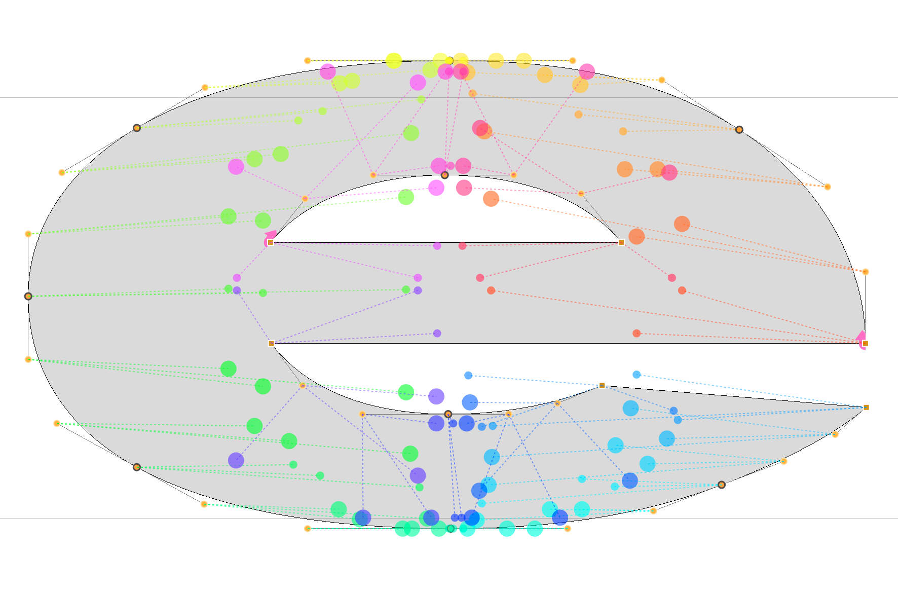

# ShowSparksTool

A small visualiser for the RoboFont Edit window.

* Shows the current glyph from **all open UFOs** (maybe that should be limited, idk.).
* Edit Tool, so you can do all the editing with this visualiser on.
* Does not preview interpolation, or do anything with the designspace data.
* Does not attempt to repair problems.
* Just draws one to one relations of the points.
* If the number of points in one of the masters does not match the others, the lines will be red.
* Snazzy rainbow color effectsm, which may or may not help. 
* All glyphs projected centered on the current view.
* Left and right margins of the other masters.
* Off curve points are bigger.

## History

* 1.3.6 ShowSparksTool made independent from DesignSpaceEditor
